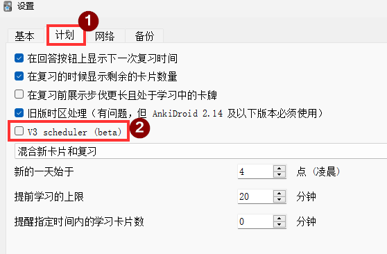

# 基本知识

## Deck 牌组

Anki中的牌组`Deck`作为笔记`Note`的容器，可以嵌套，可以设置复习计划。

* 笔记`Note`的类型`Note Type`也叫做[模板](Anki%20%E6%A8%A1%E6%9D%BF.md)或者[模板类型](Anki%20%E6%A8%A1%E6%9D%BF.md)，是一个东西。

* 笔记`Note`在现实中可以理解为一张一张的复习卡片。

* **误区**：Anki 中 卡片`Card` 有时候可以指[模板](Anki%20%E6%A8%A1%E6%9D%BF.md)，这里很容易产生误区，需要注意区分。

*图：Anki 笔记模板*
* 点开 **卡片** 实际上是打开 **模板** 编辑界面。
    

## Scheduler

* 用于编排新卡牌的学习计划、旧卡牌的复习计划。

* 进入 Anki - 工具 - 设置 - 计划 选项卡查看

  * 如果没有勾选 V3，则是 V2 版本

*图：查看Anki Scheduler 版本*


# 技巧

## 牌组的嵌套

- 示例： `Deck A::Subdeck B`

  ```
  - Deck A (Preset 1)
  - Deck A::Subdeck B (Preset 2)
      - Card B1
      - Card B2
  ```

- 操作方法：

  1. 重命名 deck

  2. 拖动 deck 到另一个 deck 中

- 嵌套牌组选项设置的[优先级](https://docs.ankiweb.net/deck-options.html#daily-limits)：

  * V1 applies parent limits to children, regardless of which deck you click on 【新版本已经不再使用V1版本】

  * 【默认】V2 behaves similarly to V1 for new cards. For reviews, only the limits of the deck you click on are honored.

  * 【需要手动启用】V3 honors the limits of the deck you click on, and any decks inside it. Limits from parents above the deck you clicked on are ignored.

## 牌组的排序

- 按文件名排序

- 可以通过数字作为开头，进行手动排序

# 牌组的设置

* 每日上限

* 新卡片

* 遗忘

* 计时器

* 搁置

* 音频

* 高级设置

  * 最大间隔

  * 初始简易度

  * 简单奖励

  * 间隔调节乘数

  * 遗忘乘数

## 参考

* [Deck Options](https://docs.ankiweb.net/deck-options.html)

* [Scheduler v2](https://faqs.ankiweb.net/the-anki-2.1-scheduler.html)

* [Scheduler v3](https://faqs.ankiweb.net/the-2021-scheduler.html)