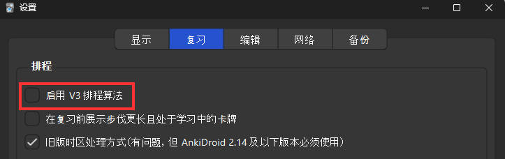

本文基于 Anki 官方文档及 Scheduler V2 测试验证及撰写。
最后修订时的 Anki 版本为：

```
版本2.1.60 (76d88073)
Python 3.9.15 Qt 6.4.2 PyQt 6.4.0
```

# 基本知识

## Deck 牌组

Anki中的牌组`Deck`作为笔记`Note`的容器，可以嵌套，可以设置复习计划。

* 笔记`Note`的类型`Note Type`也叫做[模板](Anki%20%E6%A8%A1%E6%9D%BF.md)或者[模板类型](Anki%20%E6%A8%A1%E6%9D%BF.md)，是一个东西。

* 笔记`Note`在现实中可以理解为一张一张的复习卡片。

* **误区**：Anki 中 卡片`Card` 在客户端中有时候指[模板](Anki%20%E6%A8%A1%E6%9D%BF.md)，在文档中有时候指（用于复习的正反面）卡牌，这里很容易产生误区，需要根据上下文区分。

*图：Anki 笔记模板*

* 点开 **卡片** 实际上是打开 **模板** 编辑界面。

  

## Scheduler

* 用于编排新卡牌的学习计划、旧卡牌的复习计划。

* 进入 Anki - 工具 - 设置 - 复习 选项卡查看

  * 如果没有勾选 V3，则是 V2 版本。

  * 本文档基于 V2 版本测试验证。

*图：查看Anki Scheduler 版本 (截图基于 Anki V2.1.60)*



# 牌组的常用技巧

## 牌组的嵌套

- 示例： `Deck A::Subdeck B`

  ```
  - Deck A (Preset 1)
  - Deck A::Subdeck B (Preset 2)
      - Card B1
      - Card B2
  ```

- 牌组选项的[优先级](https://docs.ankiweb.net/deck-options.html#subdecks)：当 Anki 显示一张卡牌时，它会检查这张卡牌所属的子牌组，并使用子牌组的设置。

- 牌组的`每日限制` [Daily Limits](https://docs.ankiweb.net/deck-options.html#daily-limits) 与所选择的 `Scheduer` 版本有关，以 V2 版本为例：

  - 新卡牌：使用 Parent 牌组的设置，在上例中为 *Deck A*

  - 复习卡牌：使用当前选择的牌组的设置，忽略 Parent 和 Child 牌组的设置。

- 操作方法：

  1. 重命名 deck

  2. 拖动 deck 到另一个 deck 中

## 牌组的排序

- 按文件名排序

- 可以通过数字作为开头，进行手动排序

# 卡牌的三个基本状态

Anki 卡牌有三个基本状态：

> New -> Learning -> Review

这些状态可以从卡牌复习界面看到。

*图：Anki 卡牌的基本状态*


不同的卡牌状态对应不同的设置。由于卡牌属于某个牌组，要修改卡牌设置，也就是修改`牌组设置`，点开牌组名称最右侧的齿轮 - 选择”选项“即可查看、修改牌组设置。

下面开始介绍不同状态的卡牌相关的设置。

## 新卡牌的设置


* [Learning Steps](https://docs.ankiweb.net/deck-options.html#learning-steps)：牌组选项中 `Learning Steps` (学习阶段) 设置**新卡片**要学习多少次。

  * 默认的`1m 10m`就是学习两次，第一次是1分钟后；第二次是10分钟后。

  * 如果 `Learning Steps` 设置成 `1m 10m 1d` 就需要学习3次，第一次是1分钟后；第二次是10分钟后；第三次是1天后。

  * 完成一次学习，就进入`Learning`阶段；所有学习都完成后，进入`Review`阶段。

  * 默认情况下，Anki 允许提前 `20分钟` 学习（及复习）卡片（设置-复习-提前学习的上限）。这就是为什么 **10分钟后** 才需要学习的卡片可以马上学习的原因。

* [「毕业」卡片再现间隔](https://docs.ankiweb.net/deck-options.html#learning-steps) `Graduating Interval`：

  * 其中的“毕业”实际上是指完成了`Learning Steps`进入`Review`阶段，而不是指永久熟练地记住了卡牌。

  * 在`Learning Steps`进入最后一步时，若选择`Good`所对应的下次复习时间。

  * 默认为1天。

* [「简单」卡片再现间隔](https://docs.ankiweb.net/deck-options.html#easy-interval) `Easy Interval`：

  * 跳过`Learning Steps`直接进入`Review`阶段

  * 默认为 4天。若修改设置，建议大于`Graduating Interval`。

## `Review` 阶段的卡牌设置

新版本Anki的[高级设置](https://docs.ankiweb.net/deck-options.html#advanced)主要作用于`Review`阶段的卡牌，早期版本也叫做“Review Settings”。


* [初始简易度](https://docs.ankiweb.net/deck-options.html#starting-ease) `Starting Ease`：当卡牌从`Learning`阶段进入`Review`阶段后，初始的`简易度`(`Ease`)，默认为2.5，即250%。

* [「简单」复习间隔乘数](https://docs.ankiweb.net/deck-options.html#easy-bonus) `Easy Bonus`：`Review`阶段，`Easy`所对应的乘数，默认为1.3。

* [全局间隔乘数](https://docs.ankiweb.net/deck-options.html#interval-modifier) `Interval Modifier`：`Review`阶段，作用域全局的乘数，默认为1，即没有作用。其意义在于可以调节`Retention`（保留率，即牌组中最终记住的卡片占所有卡片的百分比），具体理念可以参考官方说明。

* [「困难」复习间隔乘数](https://docs.ankiweb.net/deck-options.html#hard-interval) `Hard Interval`：`Review`阶段，`Hard`所对应的乘数，默认为1.2。

* [「重来」复习间隔乘数](https://docs.ankiweb.net/deck-options.html#new-interval) `New Interval`：`Review`阶段，`Again`所对应的乘数，默认为0，即从头开始（从`Learning Steps`第一步开始）。

> **Information**
> 有关乘数的作用及复习间隔`Interval`的**计算公式**，请参考 [Anki Interval](Anki%20Interval.md) 一文。

## 卡牌不同状态的按键行为

知道以上设置后，就容易理解在学习不同状态的卡牌时，`Again`, `Hard`, `Good`, `Easy `这些按键的行为了。

* **New**: 新建的卡片，尚未进入`Learning Steps`。

  * 特征：在卡片浏览器中，`到期`(`Due`)、`间隔`(`Interval`)和`简易度`(`Ease`)都为`新卡片`。

  * 在卡片浏览器中，可以重置卡片的学习状态： “选择卡片 - 右击 - 遗忘” 。

* **Learning**: 正在进行 `Learning Steps` 的卡片。

  * 特征：在卡片浏览器中，`到期`(`Due`)有具体日期，`间隔`(`Interval`)为`学习中`，`简易度`(`Ease`)为0%。

  * 卡牌按键的作用：

    * Again -> 重新从`Learning Steps`的第一步开始，默认为 1min。

    * Hard -> 停留在当前`Learning Step`，间隔为`Good`的数值乘以0.6。

    * Good -> **继续**`Learning Steps`的下一步，默认为 10min。

    * Easy  -> 直接进入`Review`阶段。默认为4天。设置方式：“牌组选项 - 新卡片 - 「简单」卡片再现间隔 `Easy Interval`”。

* **Review**: 完成所有 `Learning Steps` 的卡片会进入`Review`阶段。

  * 特征：在卡片浏览器中，`到期`(`Due`)有具体日期，`间隔`(`Interval`)有具体天数，`简易度`(`Ease`)为非0值（默认250%）。

    * 刚从`Learning`进入`Review`的卡片，`间隔`默认为 1。设置方式：“牌组选项 - 新卡片 - 「毕业」卡片再现间隔 `Graduating Interval`”。

    * 刚从`Learning`进入`Review`的卡片，`简易度`默认为 250%。设置方式：“牌组选项 - 高级 - 初始简易度 `Starting Ease`”。

  * 卡牌按键的说明：

    * `Again` -> 标记为 `lapsed`，同时 `lapses` 计数 +1 （可以在卡牌浏览器中看到）。关于 `Lapses` 的介绍，可以参考 [Lapses (遗忘)](#lapses-%E9%81%97%E5%BF%98)

    * `Hard`, `Good`, `Easy` 的间隔计算方法，请参考 [Anki Interval 的计算](Anki%20Interval.md)

# 其他卡牌状态

## 手动状态

在卡牌浏览器中，左侧列出了常用的卡牌状态，除了 `New`, `Learning`, `Review` 以外，还有 `Suspended`, `Buried` 状态。


### Bury 搁置

* `Bury`：该操作从复习队列中隐藏所选卡牌，==当日有效==，第二天重新显示在复习队列中。操作方法：

  1. 【推荐】在卡牌复习时，按`-`按键 (Bury Card)，搁置当前卡牌，但不搁置其相关的其他`siblings`。

  2. 在卡牌复习时，按`=`按键 (Bury Note)，搁置当前卡片及其相关的`siblings`。

  3. 在卡牌浏览器中选择卡牌，点击`Toogle Bury`。该操作也可以将`Buried`状态的卡牌改回正常状态。

* [Siblings](https://docs.ankiweb.net/studying.html#siblings-and-burying): 如果卡片模板有**多个**卡片类型，例如 `front→back` 卡牌 与 `back→front` 卡牌，他们的数据源是相同的，这种卡牌也叫做 `siblings`。

  * 如果新卡牌或者正在复习的卡牌有有 `siblings`，那么 Anki 会根据【牌组选项】中的 `搁置` 设置决定是否搁置相关联的 `siblings`。默认为【不搁置】。

  * Anki 不会搁置 `Learning` 状态的卡牌。

*图：Anki Deck Options 中的搁置选项*


### Suspend 暂停

* `Suspend`：该操作从复习队列中隐藏所选卡牌，==一直有效==，直到手动去除该状态。操作方法：

  1. 【推荐】在卡牌复习时，按`!`按键 (`Shift + 1`)。

  2. 在卡牌浏览器中选择卡牌，点击`Toogle Suspend`。该操作也可以将`Suspended`状态的卡牌改回正常状态。

### 注意事项

* 一张卡牌不能同时设置 `Suspended` 和 `Buried` 状态。

  > Note: A card cannot be buried and suspended at the same time. Suspending a buried card will unbury it. Burying a suspended card does not work on Anki 2.1.49+, whereas on earlier versions, it will unsuspend the card.

## 按照成熟度区分

在牌组统计中，可以看到`Card Counts`统计数据，除了 `New`, `Learning`, `Suspended`, `Buried` 以外，还有其他状态：`Relearning`, `Young`, `Mature`。


通过点击不同的状态，可以在卡牌浏览器中查看他们的描述：

* `Relearning`:  `deck:current ("is:review" AND "is:learn")AND -("is:buried" OR "is:suspended")`

  * 同时是 `review` 和 `learn` 的卡牌。一般不会出现，除非在复习中的卡牌上点击了`Again`，但是又没有完成`Learning Steps`。

* `Young`:  `deck:current ("is:review" AND -"is:learn") AND "prop:ivl<21"AND -("is:buried" OR "is:suspended")`

  * 下次复习间隔 `Interval` 小于 21 天的卡牌。

* `Mature`:  `deck:current ("is:review" -"is:learn") AND "prop:ivl>=21"AND -("is:buried" OR "is:suspended")`

  * 下次复习间隔 `Interval` 大于等于 21 天的卡牌。

## [**Lapses**](https://docs.ankiweb.net/deck-options.html#lapses) (遗忘)

如果学习 `Review` 阶段的卡牌时，选择 `Again` ，那么这张卡牌就被认为是 `lapsed`，同时 `lapses` 计数 +1（可以在卡牌浏览器中查看），该卡牌进入 `Relearning` （重学）阶段，并需要重新完成 `Relearning Steps` 后才重新会进入 `Review` 阶段。

具体可以在牌组选项中进行设置：

*图：Deck Options Lapses*


* [Relearning Steps](https://docs.ankiweb.net/deck-options.html#relearning-steps) 重学阶段

  * 注意：中文翻译【重学阶段】是不确切的。

  * 功能与新卡牌的 `Learning Steps` 类似。

  * 如果此处设置为空，那么卡牌会跳过 `Relearning` 并且分配一个新的复习日期。

* [Minimum Interval](https://docs.ankiweb.net/deck-options.html#minimum-interval) 最小间隔

  * 指定至少多少天后可以进入 `Review` 阶段。默认为1天，即 `interval = 1`。

* [Leeches](https://docs.ankiweb.net/leeches.html) 记忆难点

  * 如果 `lapses` 计数达到【**记忆难点阈值**】，即 `Leech Threshold` 默认为 `8`， 那么这张卡牌就会被标记为 `Leeche`。

  * 同时，根据【**记忆难点处理**】设置，即 `Leech Action`，将执行以下行为之一：

    * 仅加标签 (Tag Only)

    * 暂停卡片 (Suspend Card)

  * 发生 `Leech` 后（如果记忆卡片遇到困难的话），有以下处理方式：

    * [Waiting](https://docs.ankiweb.net/leeches.html#waiting)：学习两个易混淆的卡片时，可以暂停学习其中之一，等掌握一个后，再开始学习另一个。

    * [Deleting](https://docs.ankiweb.net/leeches.html#deleting)：删除困难的卡牌，留下重要的卡牌，提升学习乐趣。（有道理，但是为什么不新建一个 Deck 分类那些更重要的卡牌呢？编者注。）

    * [Editing](https://docs.ankiweb.net/leeches.html#editing)：重新组织卡片中的信息，例如添加助记词，高亮重要信息等。

## 其他

* [Reviewing Ahead](https://docs.ankiweb.net/filtered-decks.html#reviewing-ahead)

* [Due Reviews](https://docs.ankiweb.net/filtered-decks.html#due-reviews)

# 参考文档

* [Deck Options](https://docs.ankiweb.net/deck-options.html)

* [Filtered Decks](https://docs.ankiweb.net/filtered-decks.html)

* [siblings-and-burying](https://docs.ankiweb.net/studying.html#siblings-and-burying)

* [Leeches](https://docs.ankiweb.net/leeches.html)

* [Scheduler v2](https://faqs.ankiweb.net/the-anki-2.1-scheduler.html)

* [Scheduler v3](https://faqs.ankiweb.net/the-2021-scheduler.html)