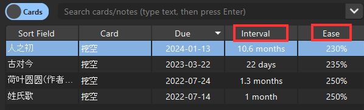

# Anki Interval 的计算方法

本文讨论 Anki `Review` 阶段卡牌 `Interval` 的计算公式。也就是复习卡牌上，`Hard`, `Good`, `Easy` 所显示的下次复习时间的计算公式。

计算方法受到 [fasiha](https://gist.github.com/fasiha/31ce46c36371ff57fdbc1254af424174) 的启发，根据 [Anki scheduler 源码](https://github.com/ankitects/anki/blob/main/pylib/anki/scheduler/v2.py) 进行总结和验证。

## 简易度 `Ease` 的作用

* `简易度`(`Ease`)在源程序中以`factor`表示，缩写为`f`。对于`Interval`的计算公式中，作为乘数参与其中。

* `Ease` 默认为 250%，作为乘数时为 2.5。

  * 具体参考[卡牌选项-高级设置](Anki%20Deck.md)

* `Ease` 最小为 130%，作为乘数时为 1.3。当`简易度`为130%时，即使点击`困难`也不会降低`简易度`。

`简易度`和`间隔`可以通过卡片浏览器查看：



## `Ease` 的计算

在`Review`阶段，按下不同的按键，`factor` 计算方法如下：

* `Again`: `f' = max(1300, f - 200)` 即 `Ease - 20%`

* `Hard`: `f' = max(1300, f - 150)` 即 `Ease - 15%`

* `Good`: `f' = f` 即 `Ease` 不变

* `Easy`: `f' = max(1300, f + 150)` 即 `Ease + 15%`

可见，`Good`不改变`Ease`，其他选项会在原有`Ease`的基础上增减。

`factor`的计算适用于新版 Scheduler，具体可以参考[v2.1.60 源码](https://github.com/ankitects/anki/blob/2.1.60/pylib/anki/scheduler/v2.py#L882)：

```python
card.factor = max(1300, card.factor + [-150, 0, 150][ease - 2])
```

## `Interval` 的计算

以下公式根据 [v2.1.60 源码](https://github.com/ankitects/anki/blob/76d8807315fcc2675e7fa44d9ddf3d4608efc487/pylib/anki/scheduler/v2.py#L910) 推导。

引入一些变量：

* `d`: 如果卡片到期后没有复习，直到今天才复习，那么从`Due Date`到`Today`的时间叫做`delay`， `delay = today - due`，缩写为`d`

* `i`: `interval` 卡片浏览器中显示的 `间隔`

* `m`: interval modifier, default is 1.0 （全局间隔乘数，默认为1）

  * `m4`: modifier for `Easy`, a.k.a. `Easy Bonus`, default is 1.3

  * `m1`: modifier for `Hard`, a.k.a. `Hard Interval`, default is 1.2

  * `m0`: modifier for `Again`, a.k.a `New Interval` default is 0

在`Review`阶段，按下不同的按键，新的`interval`计算方法如下：

* `Again`: `i1 = m0 * i`

* `Hard`: `i2 = max(i + 1, i * m1 * m)`

* `Good`: `i3 = max(i2 + 1, (i + d/2) * (f / 1000) * m)`

* `Easy`: `i4 = max(i3 + 1, (i + d) * (f / 1000) * m * m4)`

> 注意：如果长期不学习一张卡片，那么`d`会非常大，这时候按钮对应的复习时间就会很离谱。

*图：离谱的复习时间*


### 验证

从卡片浏览器中查看，上图中的卡片参数如下：

* `i = 38` (`间隔`字段)

* `f = 2500` (`简易度`250%)

* `d = 220` (today - due date)

那么，

* `Hard`: `i2 = max(i + 1, i * m1 * m) = 38 * 1.2 = 45.6d = 1.5mo`

* `Good`: `i3 = max(i2 + 1, (i + d/2) * (f / 100) * m) = (38 + 220 / 2) * 2.5 = 370d = 1yr`

* `Easy`: `i4 = max(i3 + 1, (i + d) * (f / 100) * m * m4) = (38 + 220) * 2.5 * 1.3 = 838d = 2.29yr `

# 参考

* [Deck Options](https://docs.ankiweb.net/deck-options.html)

* [Scheduler v2](https://faqs.ankiweb.net/the-anki-2.1-scheduler.html)

* [Scheduler v3](https://faqs.ankiweb.net/the-2021-scheduler.html)

* [Anki Interval Formular](https://gist.github.com/fasiha/31ce46c36371ff57fdbc1254af424174)

* [fasiha - How Anki calculates intervals](https://gist.github.com/fasiha/31ce46c36371ff57fdbc1254af424174)

* [scheduler.v2](https://github.com/ankitects/anki/blob/2.1.60/pylib/anki/scheduler/v2.py)