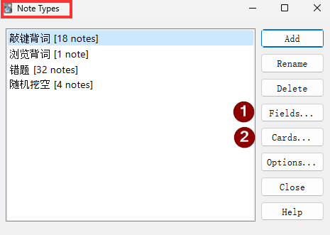
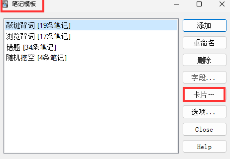
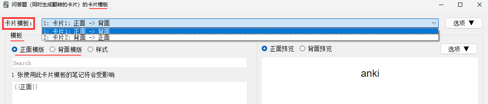
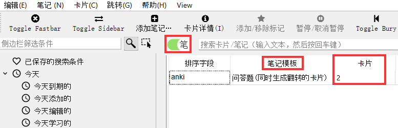
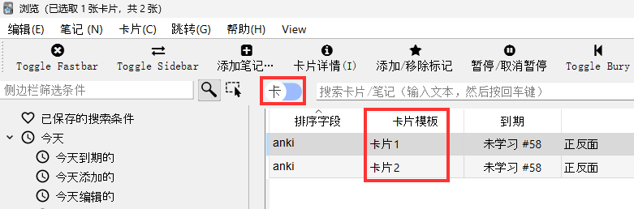

# 基础知识

- Anki 的 `模板` 有许多不同的叫法：

  - 英文版Anki中的`Note Types`

  - 中文版Anki中的`笔记类型`、`笔记模板` （见下图）

- 从桌面版的UI去理解 `模板` 的构成，其主要包含：

  - `字段` 或者 `Field`：定义你输入什么数据

  - `卡片` 或者 `Card`：打开 `卡片模板` 窗口

    - 包含：正面、反面

    - `卡片类型`

      - 一个`卡片类型`定义一个正反面，添加`卡片类型`就可以定义**多个正反面**，重复利用你输入的数据

      - Anki内置模板中的“问答题（**同时生成翻转的卡片**）”实际上创建**一个模板**，其中包含**两个**`卡片类型`

      - 注意：Cloze 类型的模板会**动态创建**`卡片模板`，所以它的`卡片模板`是不可编辑的。

*图：Anki模板示例*

- 打开路径：Anki - 工具 - 管理笔记类型





*图：Anki 卡片模板*


## 小结

* `笔记模板` 定义了数据、正反面（数据以什么方式展现）、以及有多少个正反面（卡片模板）

* `笔记模板` 包含 一个或者多个`卡片模板`，每个卡片模板定义了正反面

* 下图以“问答题（同时生成翻转的卡片）”模板为例，笔记浏览视图中：

  * 笔：笔记模板 - 有 1 张

  * 卡：卡片模板 - 有 2 张





# 用户文档摘要

- [Get Started](https://docs.ankiweb.net/getting-started.html)

- [Cloze 填空](https://docs.ankiweb.net/editing.html#cloze-deletion)

  - Multiple: `{{c2::Canberra}}` was founded in `{{c1::1913}}`.

    - `c1` `c2` 会依次挖空。

  - Hint: `{{c1::Canberra::city}}` was founded in 1913.

    - `c1` 会显示 city 作为提示词。

  - [挖空输入](https://docs.ankiweb.net/templates/fields.html#checking-your-answer):  卡片正面、背面必须都包含 `{{type:cloze:Text}}`，被挖空的词会要求输入。示例如下：

    ```
    {{cloze:Text}}
    {{type:cloze:Text}}
    {{Extra}} 
    ```

- [Field](https://docs.ankiweb.net/templates/fields.html)

  - {{MyField}} - 代表字段名称，区分大小写

  - {{**hint**:MyField}} - This will show a link labeled “show hint”; when you click it, the content of the field will be displayed on the card. (If MyField is empty, nothing will be shown.)

  - Built-in fields:

    - {{FrontSide}} - The content of the front template

    - {{Tags}} - The note's tags

    - {{Type}} - The type of note

    - {{Deck}} - The card's deck

    - {{Subdeck}} - The card's subdeck

    - {{Card}} - The type of card

  - [Field in URL](https://docs.ankiweb.net/templates/fields.html#html-stripping)

    - `<a href="http://example.com/search?q={{text:Expression}}">check in dictionary</a>`

  - [Field for media](https://docs.ankiweb.net/templates/fields.html#media--latex)

    - Image: ``

    - Sound: `[sound:{{Word}}]`

    - LaTex: `[latex]{{Field 1}}[/latex]`

- [TTS](https://docs.ankiweb.net/templates/fields.html#text-to-speech)

  - This feature requires Anki 2.1.20, or AnkiMobile 2.0.56. AnkiDroid does not currently support this method.

- [卡片生成](https://docs.ankiweb.net/templates/generation.html)

  - Rules:

    - Anki will **not** create cards with empty front sides.

    - Because of the way that card generation works, it is not possible to manually delete individual cards, as they would just end up being recreated the next time the note was edited.

  - [条件生成](https://docs.ankiweb.net/templates/generation.html#conditional-replacement)

    - `{{#FieldName}}{{Front}}{{/FieldName}}` - **如果存在**字段 `FieldName` 则生成卡片

    - `{{^FieldName}}{{Front}}{{/FieldName}}` - **如果不存在**字段 `FieldName` 则生成卡片

    - 示例 - 如果存在 Tags 则显示（生成卡片）：

      ```
      {{#Tags}}
          Tags: {{Tags}}
      {{/Tags}}
      ```

- [Files](https://docs.ankiweb.net/files.html)

  - 配置文件位置： `%APPDATA%\Anki2`

  - 媒体文件位置： `%APPDATA%\Anki2\{USER}\collection.media`

  - [Media](https://docs.ankiweb.net/media.html)

    - If you need a static image or sound on every card, name it with **a leading \_** (e.g., \_dog.jpg) to tell Anki to **ignore it when checking for media**.

# 开发文档摘要

- Anki 项目

  - [Anki Github](https://github.com/ankitects/anki)

- [Anki 插件开发](https://addon-docs.ankiweb.net/)

  - [Debug](https://addon-docs.ankiweb.net/debugging.html)

    - If you set the env var `QTWEBENGINE_REMOTE_DEBUGGING` to `8080` prior to starting Anki, you can surf to http://localhost:8080 in Chrome to debug the visible webpages.

    - `Ctrl+Shift+;` - Open debug console, press `CTRL + ENTER` to run commands.

  - [Hooks](https://addon-docs.ankiweb.net/monkey-patching.html)

    ```python
    from anki.hooks import wrap
    from aqt.editor import Editor
    
    def mySetupButtons(self, _old):
        <before code>
        ret = _old(self)
        <after code>
        return ret
    
    Editor.setupButtons = wrap(Editor.setupButtons, mySetupButtons, "around")
    ```

- AnkiDroid

  - [Javascript Inspection](https://github.com/ankidroid/Anki-Android/wiki/Development-Guide#html-javascript-inspection)

  - [Anki Cavas](https://github.com/pigoz/anki-canvas)

  - Eruda Console

    ```javascript
    <script src="https://cdn.jsdelivr.net/npm/eruda"></script>
    <script>eruda.init();</script>
    ```