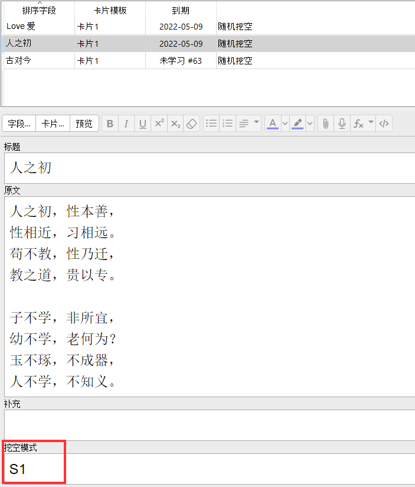
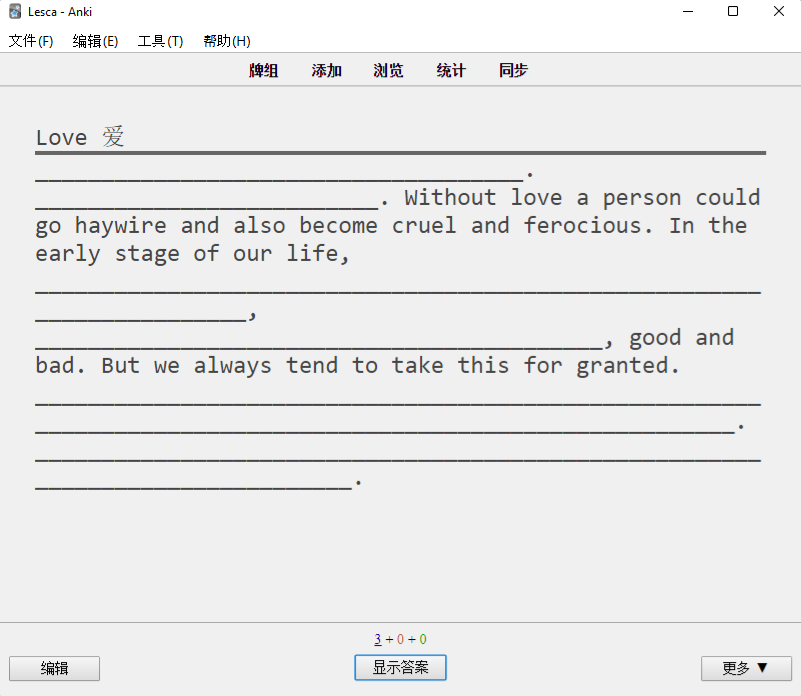
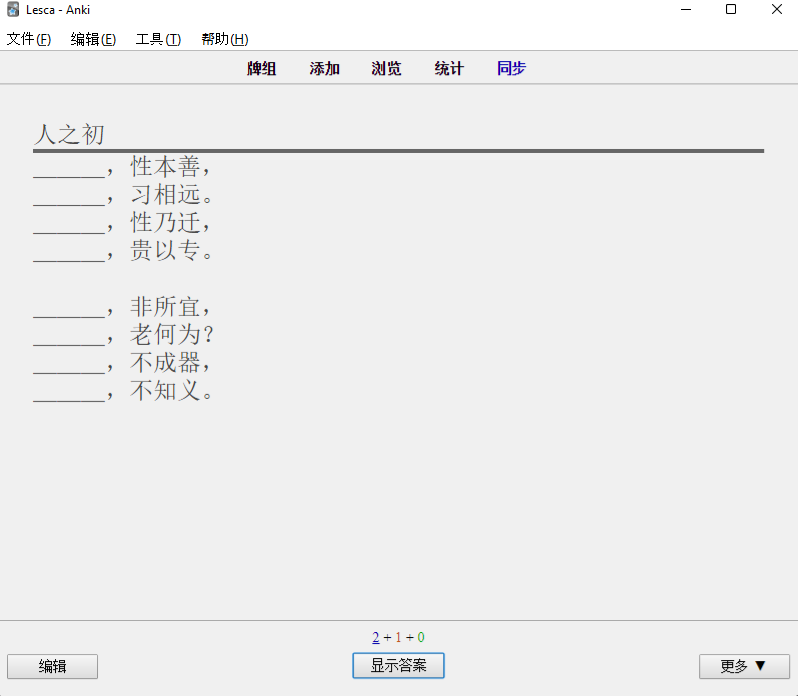
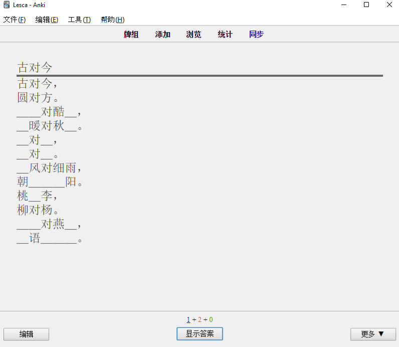

# Anki 随机挖空模板

## 获取
- [Anki 网站](https://ankiweb.net/shared/info/319512629)
- [本站](#)

## 用法
- 创建卡片，选择“随机网空”模板
- 在“原文”中以纯文本方式粘贴（快捷键`Ctrl+Shift+V`）文本
- 在`挖空模式`字段中输入挖空模式。
  - 缺省为`W`，即随机单字（词）挖空。

### 挖空模式
- `S`：句子挖空
  - 仅`S`，随机单句挖空，概率为50%
  - `Sn` - 每隔n句挖空，n范围为1~9
- W：单词（字）挖空
  - 仅`W`，随机单句挖空，概率为50%
  - `Wn` - 每隔n句挖空，n范围为1~9

## 示例
- 英文文章
- S2模式，即，每两句挖空

- 诗词类
  - S1模式，即，每隔一句挖空

- 诗词类
  - W随机模式，即，随机对单字挖空，概率50%

## 不支持的功能
目前尚不支持对指定文本（句子、单词）挖空，如果有此需求，请使用Anki自带的“填空”功能。