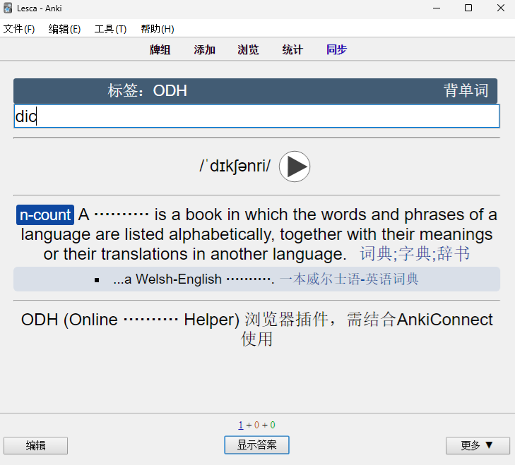
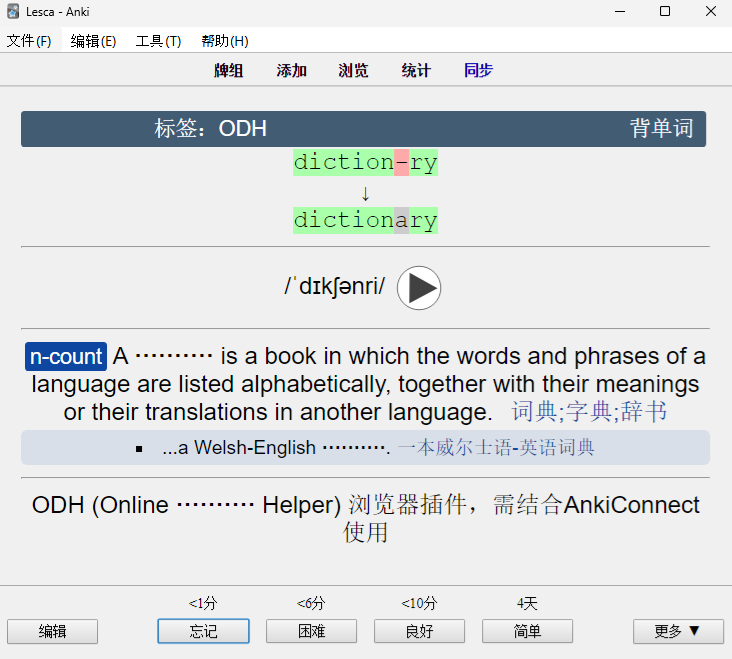
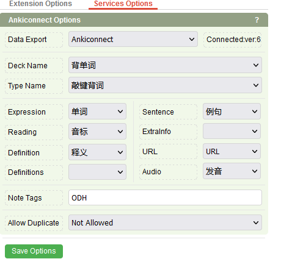

# Anki 敲键背词模板

## 效果

输入单词：



错误时比对结果：



## ODH 划词插件

桌面客户端在安装 [AnkiConnect](https://ankiweb.net/shared/info/2055492159) (2055492159) 插件后，可以结合 [ODH 浏览器插件](https://chrome.google.com/webstore/detail/online-dictionary-helper/lppjdajkacanlmpbbcdkccjkdbpllajb)使用。ODH 设置如下：



## auto rate typed answer

桌面客户端可以结合 [auto rate typed answer](https://ankiweb.net/shared/info/1836029849)  (1836029849) 插件使用

- 如果 2 秒内完成回答，自动标记为 Easy

- 如果 5.5 秒内完成回答，自动标记为 Good

- 如果 12 秒内完成回答，自动标记为 Hard

插件配置如下（修改后重启Anki生效)：

```json
{
    "accept_multiple_answers_for_these_notetypes": {},
    "easy if shorter than": 2,
    "good if shorter than": 5.5,
    "hard if shorter than": 12,
    "hard interval for cards with 2 or 3 buttons means again": false,
    "ignore case when comparing": true,
    "on mismatch ignore user rating, always rate as again/1 (2.1.20+ only)": false,
    "on mistake set focus on again": true,
    "show tooltip for confirmation": false
}
```