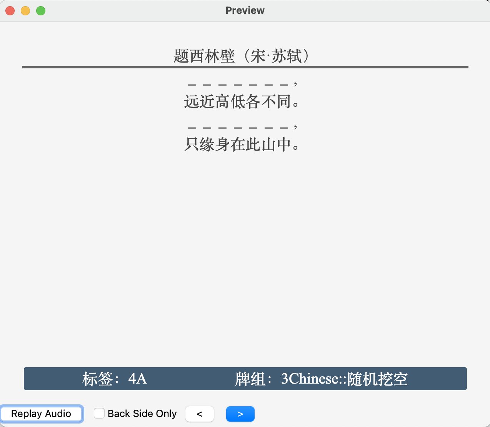
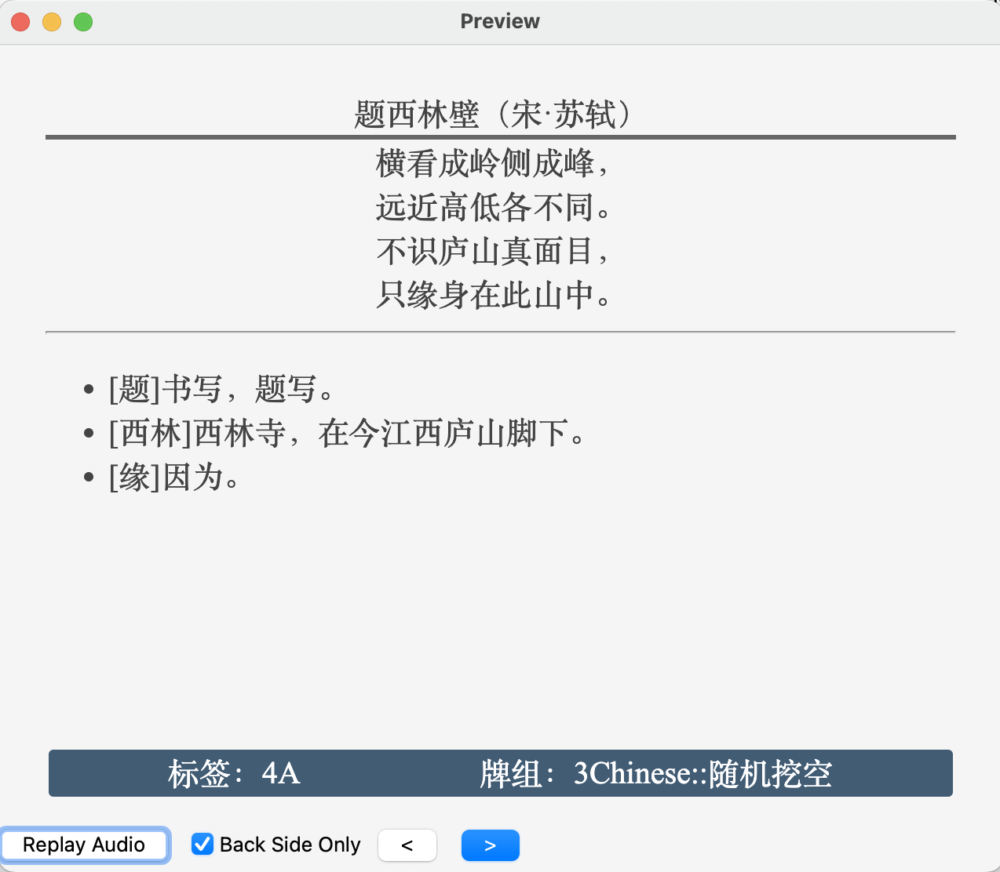

# 随机挖空模板

## 效果

### 正面

### 反面

## 用法

- 创建卡片，选择“随机网空”模板

- 在“原文”中以纯文本方式粘贴（快捷键`Ctrl+Shift+V`）文本

- 在`挖空模式`字段中输入挖空模式。

  - 默认为`S`，即句子挖空。

### 挖空模式

- `S`：句子挖空

  - 仅`S`，随机单句挖空，概率为50%

  - `Sn` - 每隔n句挖空，n范围为1~9

- W：单词（字）挖空

  - 仅`W`，随机单句挖空，概率为50%

  - `Wn` - 每隔n句挖空，n范围为1~9

